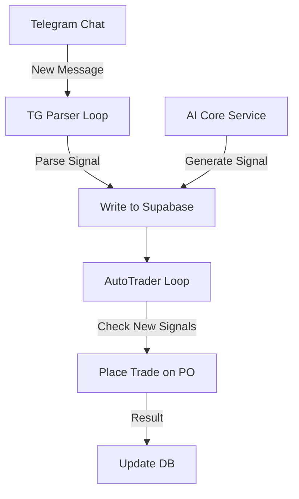

# AutoTrader Service (Repo 3)

**Критический сервис для автоматической торговли и парсинга Telegram-сигналов**

## 📋 Описание

Этот сервис объединяет два параллельных асинхронных процесса:

1. **AutoTrader Management Loop** - Управление торговыми сессиями Pocket Option и обработка сигналов из Supabase
2. **Telegram Parser Loop** - Мониторинг Telegram-чата и извлечение торговых сигналов

## 🏗️ Архитектура

### Цикл 1: AutoTrader Management
- Подключение/отключение сессий Pocket Option
- Периодическая проверка новых сигналов в Supabase (созданных AI Core Service)
- Автоматическое размещение сделок на основе сигналов
- Управление балансом демо/реальных аккаунтов

### Цикл 2: Telegram Parser
- Подключение к Telegram через Telethon (с вашим личным аккаунтом)
- Мониторинг целевого чата на предмет внешних сигналов
- Парсинг актива (например, EURUSD) и направления (CALL/PUT)
- Запись сигналов в Supabase с отметкой `source: 'telegram_parser'`

## 🔧 Переменные окружения

### Обязательные:
```env
# Supabase
NEXT_PUBLIC_SUPABASE_URL=https://your-project.supabase.co
NEXT_PUBLIC_SUPABASE_ANON_KEY=your-anon-key

# Шифрование
ENCRYPTION_KEY=your-32-char-encryption-key

# Telegram API (для Telethon)
TG_API_ID=12345678
TG_API_HASH=your_telegram_api_hash
TARGET_CHAT_ID=-1001234567890

# Администратор (для логов)
ADMIN_USER_ID=123456789
```

## 📦 Установка

```bash
# Установка зависимостей
pip install -r requirements.txt

# Запуск сервиса
python main.py
```

## 🔐 Безопасность

- Все учетные данные Pocket Option **дешифруются** перед использованием
- Используется Fernet (symmetric encryption) с PBKDF2HMAC
- Соль: `b'pocket-option-login-encryption'` (должна совпадать во всех репозиториях)

## 🚨 Важные замечания

1. **Требуется файл `pocket_option_api.py`** - класс `PocketOptionAPI` должен находиться в той же директории
2. **Telethon Session** - При первом запуске потребуется авторизация через телефон
3. **Regex для парсинга** - Формат: `EURUSD | CALL (98% Confidence)`
4. **PEP-8 Compliant** - Код соответствует стандартам Python

## 📊 Структура БД (Supabase)

### Таблица `users`:
- `user_id` (int)
- `autotrade_enabled` (bool)
- `pocket_option_email` (text, encrypted)
- `pocket_option_password` (text, encrypted)
- `is_real_account` (bool)

### Таблица `signals`:
- `id` (uuid)
- `asset` (text) - например, "EURUSD"
- `direction` (text) - "CALL" или "PUT"
- `confidence` (float)
- `source` (text) - "ai_core" или "telegram_parser"
- `processed_by_autotrader` (bool)
- `created_at` (timestamp)

## 🔄 Workflow



## 🛠️ Тестирование

```bash
# Проверка синтаксиса
python3 -m py_compile main.py

# Тест подключения к Supabase (добавьте свои переменные в .env)
python main.py
```

## 📞 Поддержка

При возникновении ошибок проверьте:
- [ ] Все переменные окружения заданы
- [ ] Supabase доступен и таблицы созданы
- [ ] Telethon-сессия авторизована
- [ ] Файл `pocket_option_api.py` присутствует
- [ ] ENCRYPTION_KEY совпадает с Repo 1 и 2

## 📄 Лицензия

Proprietary - Для личного использования
